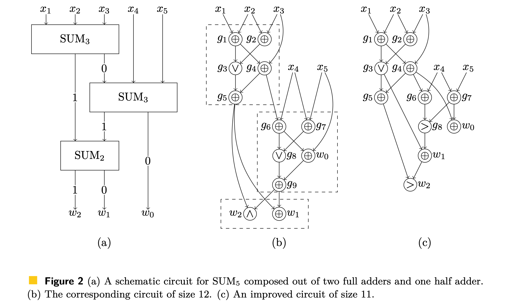

# SAT-based Circuit Local Improvement

The two main features of the program (both are implemented with the help of SAT-solvers):
1. Find an efficient Boolean circuit for a given function.
2. Given a circuit, find a smaller circuit computing the same function.

A high-level overview of all features is given in the [paper](https://arxiv.org/abs/2102.12579).
To run the program in the cloud (without installing anything on your machine), press the badge below.

                                                                                                
